# CV- Object Detection, Face Attendance, Gesture Recognition, Depth Estimation, ROI-based Analytics Projects

A portfolio of standalone computer vision projects — object detection, face attendance/recognition, gesture & sign-language recognition, depth estimation, and ROI-based analytics. Each project lives in its own folder with its own dependencies and is run independently.

## Contents

| # | Project | Category | Folder |
|---|---------|----------|--------|
| 1 | [Engine Part Detection](#1-engine-part-detection) | Object Detection (VLM) | `Engine Part Detection/` |
| 2 | [Face Attendance — Face Recognition](#2-face-attendance--face-recognition) | Face Attendance | `Face-attendance-Face-recognition/` |
| 3 | [Smart Attendance with Real-Time Database](#3-smart-attendance-with-real-time-database) | Face Attendance | `Smart-Attendance-with-Real-Time-Database/` |
| 4 | [No Helmet Detection](#4-no-helmet-detection) | Object Detection + OCR | `no_helmet_detection/` |
| 5 | [OD ROI Areas](#5-od-roi-areas) | Object Detection + Tracking | `OD_ROI_Areas/` |
| 6 | [Sign Language Detection](#6-sign-language-detection) | Gesture Recognition | `sign_lan_detections/` |
| 7 | [Monocular Depth + 3D Object Detection](#7-monocular-depth--3d-object-detection) | Object Detection + Depth | `monocular-depth-object-detection-main/` |
| 8 | [Computer Vision Based Track Pad](#8-computer-vision-based-track-pad-airscroll) | Gesture Recognition | `Computer-Vision-Based-Track-Pad-main/` |
| 9 | [ANPR (Classic CV)](#anpr-classic-cv) | Object Detection + OCR | `ANPR/` |
| 10 | [ANPR — YOLOv8 + EasyOCR + SORT](#anpr-yolov8-easyocr-sort) | Object Detection + Tracking + OCR | `Anpr_YOLOv8_EasyOCR/` |
| 11 | [YOLO11 Number Plate + MySQL](#yolo11-numberplate-mysql) | Object Detection + OCR + DB | `yolo11-numberplate-xampp-server-main/` |
| 12 | [Parking Spot Occupancy Detection](#parking-spot-occupancy-detection) | Classification + Analytics | `parking_spot_detection/` |
| 13 | [YOLO Parking Space (Custom Zones)](#yolo-parking-space-custom-zones) | Object Detection + Analytics | `yolo_parking_space/` |
| 14 | [Face Anonymization](#face-anonymization) | Privacy / Face Detection | `Anonymizing_Face_detection/` |
| 15 | [Face Emotion Detection](#face-emotion-detection) | Object Detection + Classification | `Emotion_detection/` |
| 16 | [Face Classification (Emotion + Gender)](#face-classification-emotion-gender) | Face Detection + Classification | `face_classification/` |
| 17 | [Browser Face Recognition (face-api.js)](#browser-face-recognition) | Face Recognition (Web) | `face_rec_javascript/` |
| 18 | [QR Code Attendance System](#qr-code-attendance-system) | QR Detection + Attendance | `QR_reader+attendance_system/` |
| 19 | [Scene Text Detection](#scene-text-detection) | OCR | `Text_Detection/` |
| 20 | [Color Detection](#color-detection) | Color Segmentation | `color_detection/` |
| 21 | [Image Classifier (SVM)](#image-classifier-svm) | Classification | `image-classifier/` |
| 22 | [Computer Vision Projects (Toolkit)](#cv-toolkit) | Counting, Privacy, Fall Detection, QA | `ComputerVision-projects-github/` |

Jump to [More Projects](#more-projects) for the full gallery with previews, tech stack, and usage details for projects 9–22.

---

## 1. Engine Part Detection

Identifies engine parts in a video stream by sending sampled frames to Google's Gemini vision model and printing back the part name and material.

- **Script:** `Enginepart.py`
- **Input:** `parts.mp4` (a Mega.nz download link for the sample clip is in `vid.txt`), or a webcam (pass an empty string).
- **Model:** `gemini-2.0-flash` via `langchain-google-genai` (cloud inference, no local weights).

### Run it
```bash
cd "Engine Part Detection"
pip install opencv-python langchain-core langchain-google-genai
# set your own key instead of the one hardcoded in Enginepart.py
set GOOGLE_API_KEY=your-key-here        # PowerShell: $env:GOOGLE_API_KEY="your-key-here"
python Enginepart.py
```
Press `q` to stop. Every 5 seconds the current frame is sent to Gemini and the identified part/material is printed to the console — that console output is the "result" for this project (no file is written).

> ⚠️ `Enginepart.py` currently hardcodes a Google API key as a fallback default. Replace it with your own key and avoid committing real keys to source control.

---

## 2. Face Attendance — Face Recognition

A Tkinter desktop app that logs in/out users by webcam face recognition (via `face_recognition`/`dlib` embeddings) and stores a timestamped attendance log.

- **Scripts:** `main.py` (basic, single-face, `.txt` log) and `Main_Updated.py` (multi-face, adds a `.csv` log).
- **Database:** `db/` holds one `.pickle` (face embedding) + `.png` (captured photo) per registered user.

### Run it
```bash
cd Face-attendance-Face-recognition
pip install -r requirements.txt
python Main_Updated.py     # or: python main.py
```
1. Click **register new user**, capture a face, and name it.
2. Click **Login** / **logout** to recognize the face against `db/` and append a row to `log.txt` / `log.csv`.

**Results / analysis:** `log.csv` (Name, Date, Timestamp, Action) and `log.txt` are the attendance records to analyze.

**Sample registered user** (`db/Michael Micah.png`):


---

## 3. Smart Attendance with Real-Time Database

A Firebase-backed attendance kiosk: recognizes a face, looks up the student in Firebase Realtime Database/Storage, and increments their attendance counter with a styled overlay UI.

- **Scripts (run in order):** `AddDatatoDatabase.py` → `EncodeGenerator.py` → `main.py`.

### Run it
```bash
cd Smart-Attendance-with-Real-Time-Database
pip install opencv-python face_recognition cvzone numpy firebase_admin
```
1. Add your Firebase service account file as `serviceAccountKey.json` and fill in `databaseURL`/`storageBucket` in `main.py`.
2. Provide `Resources/background.png` and `Resources/Modes/*.png` (UI background/overlay assets — not included in this checkout) plus student photos uploaded to Firebase Storage under `Images/<id>.png`.
3. `python AddDatatoDatabase.py` — seed student records into Firebase.
4. `python EncodeGenerator.py` — builds `EncodeFile.p` (face encodings) from the student photos.
5. `python main.py` — runs the live webcam attendance kiosk.

**Results / analysis:** attendance counts and `last_attendance_time` are updated directly in the Firebase Realtime Database (`Students/<id>`), viewable from the Firebase console.

> This folder ships only the source scripts — the `Resources/` UI assets, `serviceAccountKey.json`, and `EncodeFile.p` are generated/provided locally and intentionally not committed.

---

## 4. No Helmet Detection

YOLO detects riders without a helmet plus their number plate inside a defined ROI polygon; PaddleOCR reads the plate text and logs the violation.

- **Script:** `main.py`
- **Model:** `best.pt` (custom YOLO)
- **Input:** `final.mp4`

### Run it
```bash
cd no_helmet_detection
pip install -r requirements.txt
python main.py
```
Press `q` to stop.

**Results / analysis:** for each violation, a cropped plate image is saved into a folder named for today's date (e.g. `2025-01-06/`) as `<plate-text>_<HH-MM-SS>.jpg`, and a row `[Number Plate, Date, Time]` is appended to `<date>/<date>.xlsx` for downstream analysis.

**Sample detected plate crops** (`2025-01-06/`):

<p>
  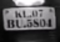
  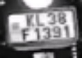
</p>

---

## 5. OD ROI Areas

Counts/labels people inside a hand-defined ROI polygon using YOLO11 + tracking, and writes an annotated output video.

- **Script:** `main.py`
- **Model:** `yolo11s.pt`
- **Input:** `pcount.mp4`, **Output:** `output.mp4`

### Run it
```bash
cd OD_ROI_Areas
pip install opencv-python numpy ultralytics cvzone
python main.py
```
Press `q` to stop early.

**Results / analysis:** `output.mp4` — the annotated video with the ROI polygon and labeled detections inside it, ready for review.

**Result preview** (`output.gif`, generated from `output.mp4`):

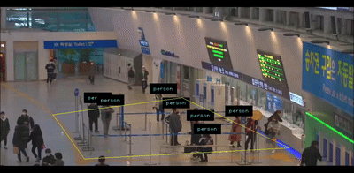

---

## 6. Sign Language Detection

Classifies static hand signs (A/B/L) from MediaPipe hand landmarks using a trained scikit-learn classifier, and records the annotated webcam feed.

- **Pipeline:** `data_collections.py` (capture samples) → `create_dataset.py` (extract landmark features → `data.pkl`) → `train_classifier.py` (train + evaluate → `model.p`, training plots) → `test_classifier.py` (live inference → `output.mp4`).

### Run it
```bash
cd sign_lan_detections
pip install -r requirements.txt
python test_classifier.py     # live inference using the pretrained model.p
```
To retrain from scratch: `python data_collections.py` → `python create_dataset.py` → `python train_classifier.py`.

**Results / analysis:** `train_classifier.py` reports accuracy and saves evaluation plots (`Figure_1.png`, `Figure_2.png`, `Figure_3.png`); `test_classifier.py` writes the live-annotated session to `output.mp4`.

**Training result plots:**

<p>
  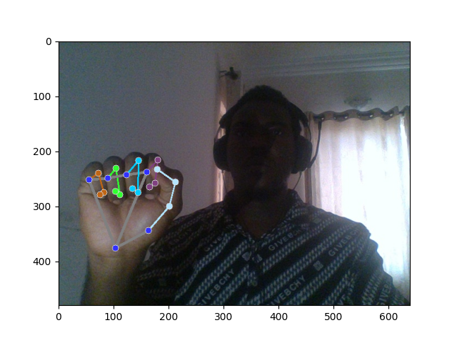
  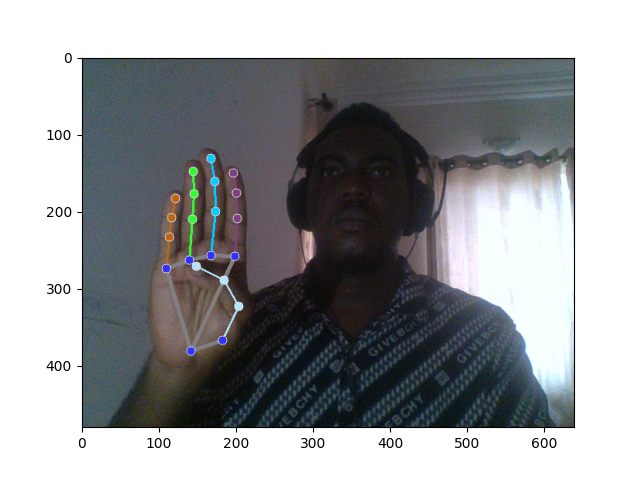
  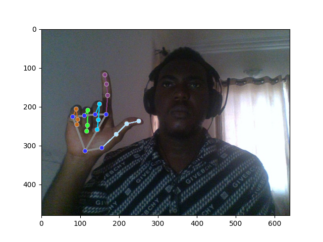
</p>

**Live inference preview** (`output.gif`, generated from `output.mp4`):


---

## 7. Monocular Depth + 3D Object Detection

YOLO detection/segmentation combined with monocular depth estimation (Apple ml-depth-pro) and Open3D to produce per-object distances and 3D bounding boxes. See its own [README](monocular-depth-object-detection-main/README.md) and [PROJECT_GUIDE.md](monocular-depth-object-detection-main/PROJECT_GUIDE.md) for full pipeline details.

### Run it
```bash
cd monocular-depth-object-detection-main
pip install -r requirements.txt
python distance_estimation_yolo_video.py     # 2D boxes annotated with distance
python seg_3d_bbox_video.py                  # 3D point clouds + 3D bounding boxes
```

**Results / analysis:** annotated frames with distance labels, depth-map visualizations, and rendered 3D point clouds/bounding boxes.

**Example output:**

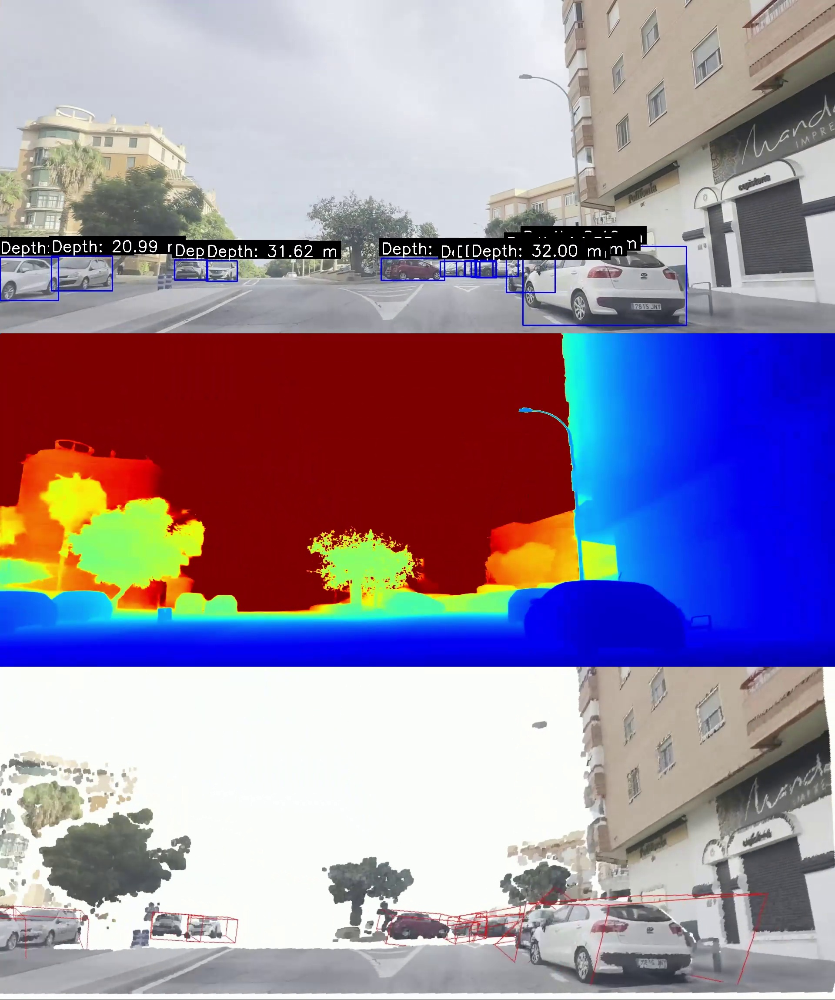

---

## 8. Computer Vision Based Track Pad (AirScroll)

Touchless scroll control: a YOLOv5 classifier detects an "Active"/"Inactive" hand state and optical flow translates hand motion into scroll events, with a HUD overlay.

- **Script:** `main.py`
- **Model:** `best.pt` (YOLOv5 classification)

### Run it
This script imports directly from a local `yolov5` checkout (`models.common`, `utils.general`, `utils.torch_utils`), so it must sit two directories below a cloned [ultralytics/yolov5](https://github.com/ultralytics/yolov5) repo (or adjust `YOLO_ROOT` in `main.py`).
```bash
git clone https://github.com/ultralytics/yolov5
pip install opencv-python torch torchvision pyautogui numpy
# place/copy Computer-Vision-Based-Track-Pad-main two levels under yolov5/, then:
cd Computer-Vision-Based-Track-Pad-main
# edit MODEL_PATH in main.py to point at best.pt
python main.py
```
Press `q` to stop.

**Results / analysis:** a live HUD shows classification confidence, scroll speed, FPS, and optical-flow direction arrows — see the [project README](Computer-Vision-Based-Track-Pad-main/README.md) for a recorded demo clip.

---

## More Projects

A gallery of additional standalone CV projects in this lab. Each card links straight to its folder in this repo.

<table>
  <tr>
    <td width="5%" align="center">
      <h3 id="anpr-classic-cv">🚘 ANPR (Classic CV)</h3>
      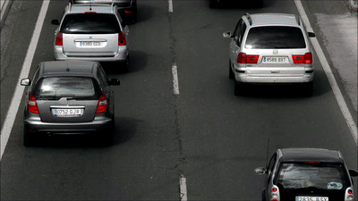
      <p><a href="https://github.com/Micahmichael02/Object-Detections-and-Tracking-Lab/tree/main/ANPR"><strong>View Repository →</strong></a></p>
      <p><strong>Tech:</strong> OpenCV (grayscale/Canny/contours), EasyOCR, Jupyter Notebook</p>
      <p>Locates a vehicle's license plate without any deep-learning detector — edge detection + contour filtering finds the plate-shaped region, then EasyOCR reads the text, for both a single image (<code>plate_no_detection.ipynb</code>) and frame-by-frame video (<code>video_plate-no_detection.ipynb</code>).</p>
    </td>
    <td width="5%" align="center">
      <h3 id="anpr-yolov8-easyocr-sort">🚗 ANPR — YOLOv8 + EasyOCR + SORT</h3>
      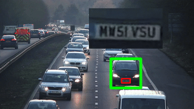
      <p><a href="https://github.com/Micahmichael02/Object-Detections-and-Tracking-Lab/tree/main/Anpr_YOLOv8_EasyOCR"><strong>View Repository →</strong></a></p>
      <p><strong>Tech:</strong> YOLOv8 (vehicle + plate detection), SORT tracking, EasyOCR, Pandas</p>
      <p>Two YOLOv8 models detect vehicles and license plates per frame; SORT tracks each vehicle across frames so a plate is only OCR'd once per car, and results (bbox, plate text, OCR confidence) are written to CSV via <code>visualize.py</code> / <code>add_missing_data.py</code>.</p>
    </td>
  </tr>
  <tr>
    <td width="5%" align="center">
      <h3 id="yolo11-numberplate-mysql">🅿️ YOLO11 Number Plate + MySQL</h3>
      
      <p><a href="https://github.com/Micahmichael02/Object-Detections-and-Tracking-Lab/tree/main/yolo11-numberplate-xampp-server-main"><strong>View Repository →</strong></a></p>
      <p><strong>Tech:</strong> YOLO11 (TFLite export), PaddleOCR, OpenCV, MySQL (XAMPP)</p>
      <p>Tracks vehicles crossing a defined polygon zone with a YOLO11 TFLite model, OCRs the cropped plate with PaddleOCR, and persists each unique plate + entry date/time into a MySQL <code>numberplate</code> table (<code>server.py</code>) running under XAMPP.</p>
    </td>
    <td width="5%" align="center">
      <h3 id="parking-spot-occupancy-detection">🅿️ Parking Spot Occupancy Detection</h3>
      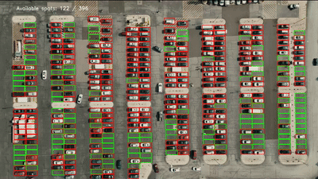
      <p><a href="https://github.com/Micahmichael02/Object-Detections-and-Tracking-Lab/tree/main/parking_spot_detection"><strong>View Repository →</strong></a></p>
      <p><strong>Tech:</strong> OpenCV connected components, scikit-learn SVM, scikit-image</p>
      <p>A hand-painted mask locates every parking spot via connected-components analysis; each spot is sampled every 30 frames and classified empty/occupied by a pretrained SVM (<code>model.pkl</code>, trained in <a href="https://github.com/Micahmichael02/Object-Detections-and-Tracking-Lab/tree/main/image-classifier">image-classifier</a>), with a live "Available spots: X / Y" overlay.</p>
    </td>
  </tr>
  <tr>
    <td width="5%" align="center">
      <h3 id="yolo-parking-space-custom-zones">🅿️ YOLO Parking Space (Custom Zones)</h3>
      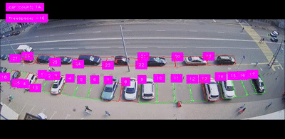
      <p><a href="https://github.com/Micahmichael02/Object-Detections-and-Tracking-Lab/tree/main/yolo_parking_space"><strong>View Repository →</strong></a></p>
      <p><strong>Tech:</strong> YOLOv8/YOLO11, OpenCV polygon drawing, cvzone</p>
      <p>Draw and name arbitrary polygon parking zones by hand on a paused frame (<code>detect.py</code>, saved to a <code>freedomtech</code> pickle file), then run YOLO detection inside each zone to flag which custom-shaped spots are occupied — handy for irregular lots a single mask can't cover.</p>
    </td>
    <td width="5%" align="center">
      <h3 id="face-anonymization">🙈 Face Anonymization</h3>
      
      <p><a href="https://github.com/Micahmichael02/Object-Detections-and-Tracking-Lab/tree/main/Anonymizing_Face_detection"><strong>View Repository →</strong></a></p>
      <p><strong>Tech:</strong> OpenCV, MediaPipe Face Detection</p>
      <p>Detects every face in an image, video file, or live webcam feed with MediaPipe and blurs it in place for privacy/compliance — three entry points (<code>blurimg.py</code>, <code>blurvideo.py</code>, <code>blurwebcam.py</code>) cover each input type.</p>
    </td>
  </tr>
  <tr>
    <td width="5%" align="center">
      <h3 id="face-emotion-detection">😀 Face Emotion Detection</h3>
      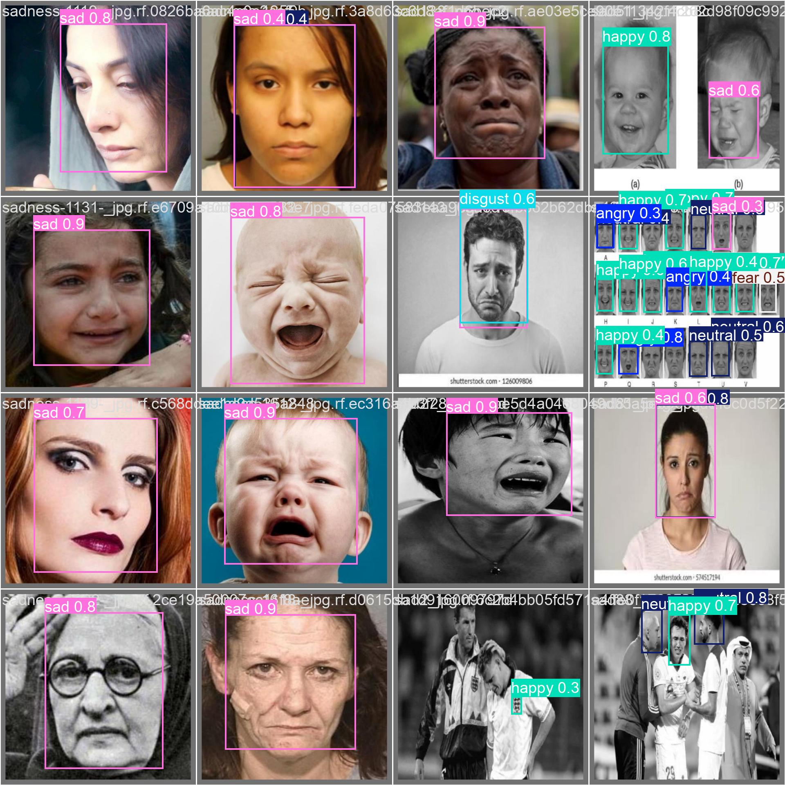
      <p><a href="https://github.com/Micahmichael02/Object-Detections-and-Tracking-Lab/tree/main/Emotion_detection"><strong>View Repository →</strong></a></p>
      <p><strong>Tech:</strong> Ultralytics YOLO, custom-trained face-emotions dataset</p>
      <p>A YOLO model fine-tuned on a labeled face-emotions dataset detects faces and classifies the emotion (happy/sad/angry/neutral/fear/disgust) directly as the bounding-box label; <code>Emotions_detections.ipynb</code> walks through training and inference end-to-end.</p>
    </td>
    <td width="5%" align="center">
      <h3 id="face-classification-emotion-gender">🧠 Face Classification (Emotion + Gender)</h3>
      
      <p><a href="https://github.com/Micahmichael02/Object-Detections-and-Tracking-Lab/tree/main/face_classification"><strong>View Repository →</strong></a></p>
      <p><strong>Tech:</strong> Keras CNN (mini-XCEPTION), OpenCV, fer2013 + IMDB datasets</p>
      <p>Real-time face detection feeding two Keras CNN classifiers in parallel — emotion (fer2013, 66% test accuracy) and gender (IMDB, 96% test accuracy) — plus a guided-backprop demo that visualizes what the CNN focuses on. (Vendored from <a href="https://github.com/oarriaga/face_classification">oarriaga/face_classification</a>.)</p>
    </td>
  </tr>
  <tr>
    <td width="5%" align="center">
      <h3 id="browser-face-recognition">🌐 Browser Face Recognition (face-api.js)</h3>
      
      <p><a href="https://github.com/Micahmichael02/Object-Detections-and-Tracking-Lab/tree/main/face_rec_javascript"><strong>View Repository →</strong></a></p>
      <p><strong>Tech:</strong> face-api.js (TensorFlow.js), SSD Mobilenet, vanilla JS</p>
      <p>A pure browser demo — loads SSD Mobilenet + face-recognition-net + landmark models client-side, builds labeled face descriptors from <code>Data/&lt;name&gt;/*.png</code>, then matches every face in the live webcam feed against those labels in real time.</p>
    </td>
    <td width="5%" align="center">
      <h3 id="qr-code-attendance-system">📷 QR Code Attendance System</h3>
      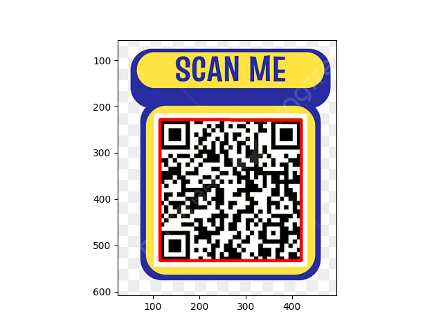
      <p><a href="https://github.com/Micahmichael02/Object-Detections-and-Tracking-Lab/tree/main/QR_reader%2Battendance_system"><strong>View Repository →</strong></a></p>
      <p><strong>Tech:</strong> OpenCV, pyzbar</p>
      <p>Decodes QR codes from a static image (<code>main.py</code>) or live webcam (<code>main_webcam.py</code>), checks the payload against <code>whitelist.txt</code>, overlays Authorized/Unauthorized on-frame, and appends a timestamped row to <code>attendance.txt</code> for every newly-seen authorized code.</p>
    </td>
  </tr>
  <tr>
    <td width="5%" align="center">
      <h3 id="scene-text-detection">🔤 Scene Text Detection</h3>
      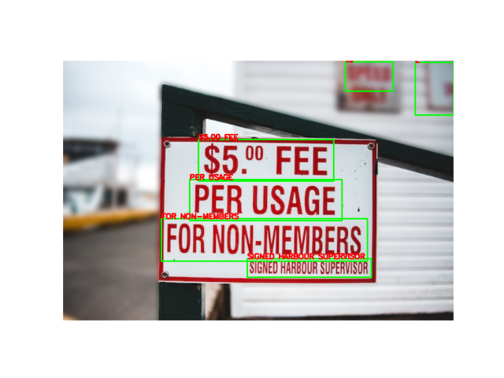
      <p><a href="https://github.com/Micahmichael02/Object-Detections-and-Tracking-Lab/tree/main/Text_Detection"><strong>View Repository →</strong></a></p>
      <p><strong>Tech:</strong> EasyOCR, OpenCV, Matplotlib</p>
      <p>Runs EasyOCR over an input image to localize and read every text region, drawing bounding boxes and the recognized string back onto the image for review.</p>
    </td>
    <td width="5%" align="center">
      <h3 id="color-detection">🎨 Color Detection</h3>
      <p><a href="https://github.com/Micahmichael02/Object-Detections-and-Tracking-Lab/tree/main/color_detection"><strong>View Repository →</strong></a></p>
      <p><strong>Tech:</strong> OpenCV, NumPy, Pillow</p>
      <p>Converts each webcam frame to HSV, builds a tolerant hue range around a target BGR color (yellow by default) via <code>util.get_limits</code>, masks it, and draws a bounding box around the largest matching region in real time.</p>
    </td>
  </tr>
  <tr>
    <td width="5%" align="center">
      <h3 id="image-classifier-svm">🖼️ Image Classifier (SVM)</h3>
      
      <p><a href="https://github.com/Micahmichael02/Object-Detections-and-Tracking-Lab/tree/main/image-classifier"><strong>View Repository →</strong></a></p>
      <p><strong>Tech:</strong> scikit-learn (SVM + GridSearchCV), scikit-image</p>
      <p>Trains an SVM (grid-searched over <code>C</code>/<code>gamma</code>) on resized 15×15 images from <code>clf-data/empty</code> and <code>clf-data/not_empty</code>, producing <code>model.pkl</code> — this is the exact classifier <a href="https://github.com/Micahmichael02/Object-Detections-and-Tracking-Lab/tree/main/parking_spot_detection">parking_spot_detection</a> loads to decide if a parking spot is occupied.</p>
    </td>
    <td width="5%" align="center">
      <h3 id="cv-toolkit">🧰 Computer Vision Projects (Toolkit)</h3>
      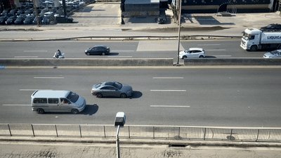
      <p><a href="https://github.com/Micahmichael02/Object-Detections-and-Tracking-Lab/tree/main/ComputerVision-projects-github"><strong>View Repository →</strong></a></p>
      <p><strong>Tech:</strong> PyTorch, Ultralytics YOLO, Supervision, OpenCV</p>
      <p>A small toolkit of four standalone tools sharing one dependency set: multi-lane vehicle counting, license-plate blurring for privacy, human fall detection from body keypoints, and vaccine-bottle cap/seal monitoring on a production line. See its own <a href="https://github.com/Micahmichael02/Object-Detections-and-Tracking-Lab/tree/main/ComputerVision-projects-github#-projects-catalog">README</a> for per-tool config.</p>
    </td>
  </tr>
</table>

<!--
Maintainer notes (not rendered): how the demo GIFs were made, and the template for adding a new project.

## Converting an MP4 result into a GIF

Every project above that writes an `output.mp4`/result video can be turned into a lightweight, README-friendly GIF the same way (uses `ffmpeg`'s two-pass palette generation for good quality at a small file size):

```bash
ffmpeg -y -i input.mp4 -t 8 -vf "fps=8,scale=400:-1:flags=lanczos,split[s0][s1];[s0]palettegen[p];[s1][p]paletteuse" output.gif
```
- `-t 8` — only encode the first 8 seconds (drop it to convert the whole clip).
- `fps=8` — lower frame rate keeps the GIF small.
- `scale=400:-1` — resize width to 400px, keep aspect ratio (raise/lower for quality vs. size).

This is exactly the command used to generate `OD_ROI_Areas/output.gif` and `sign_lan_detections/output.gif` above.

---

## Adding more projects

This README is structured so a new project just needs a new numbered section following the same template:

```markdown
## N. <Project Name>

Short description of what it does.

- **Script:** ...
- **Model/Input:** ...

### Run it
\`\`\`bash
cd <folder>
pip install -r requirements.txt
python <script>.py
\`\`\`

**Results / analysis:** where output files/images/video land and what to look at.

(embed any output images/GIFs here)
```

Add the new row to the [Contents](#contents) table at the top, pointing at the new section anchor and folder.
-->
